# Front-End em Angular para um Sistema de Biblioteca

## 💻 Tecnologies

- Angular v14
- Angular Material

## ⌨️ Editor / IDE

- Visual Studio Code

## Funcionalidades disponíveis

- ✅ Componentes do Angular Material
- ✅ Lista de todas as categorias com paginação
- ✅ Lista de todos os livros por categoria com paginação
- ✅ Formulários para criar e atualizar categorias e livros (Relacionamento um para muitos)
- ✅ Tela de Visualização do Registros (Categorias e Livros)

## Capturas de tela

Página Inicial - Desktop

<p align="center">
  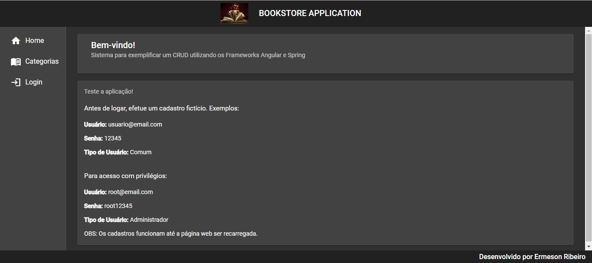
</p>

Página Inicial - Mobile

<p align="center">
  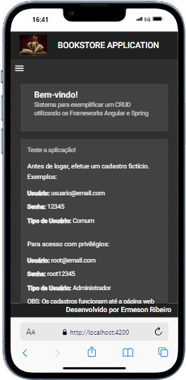
</p>

Página de Login - Desktop

<p align="center">
  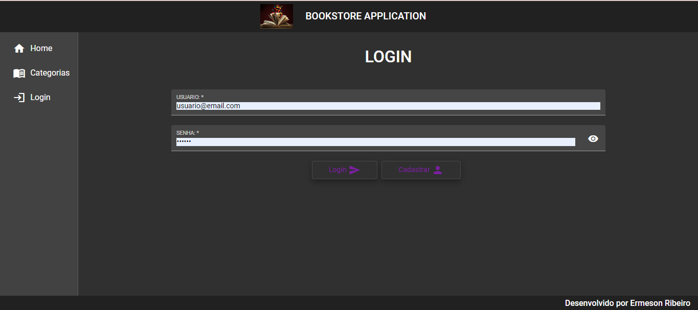
</p>

Página de Login - Mobile

<p align="center">
  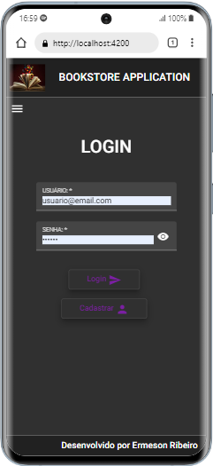
</p>

Página de Cadastro - Desktop

<p align="center">
  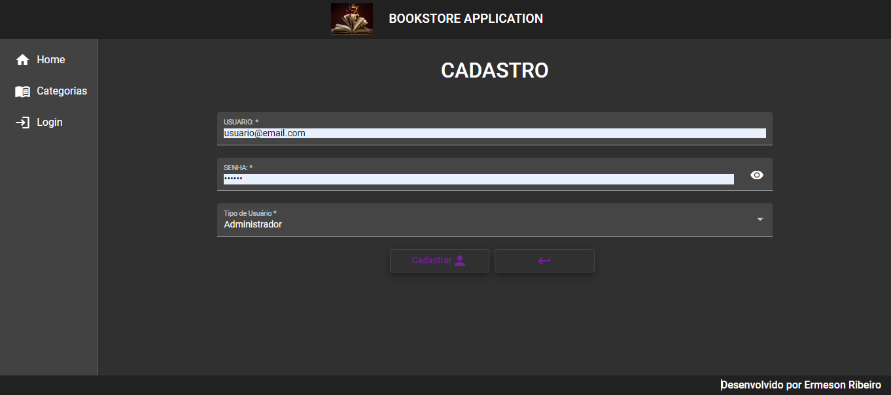
</p>

Página de Cadastro - Mobile

<p align="center">
  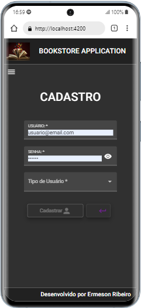
</p>

Página de Categorias com Paginação

<p align="center">
  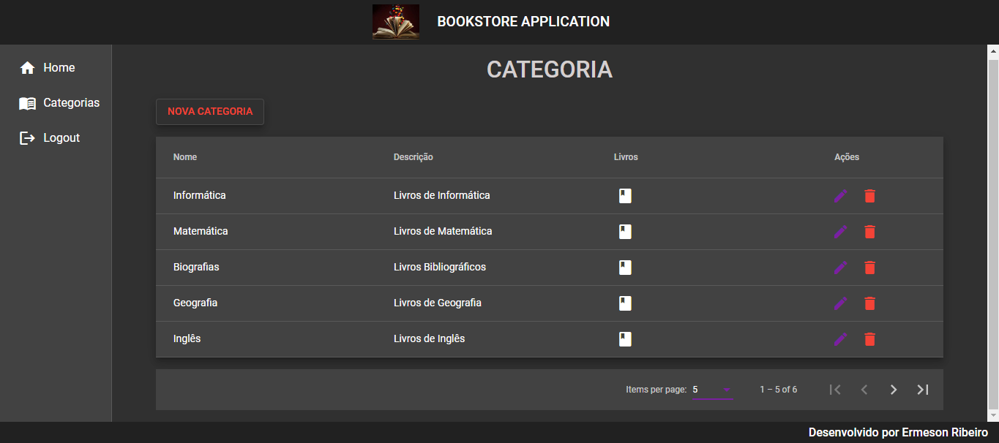
</p>

Página com Um para Muitos (Categoria-Livros)

<p align="center">
  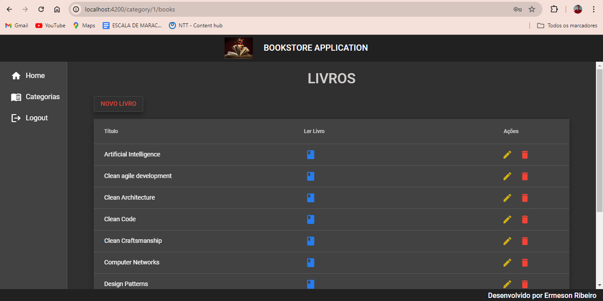
</p>

Página de Livros com Paginação - Desktop

<p align="center">
  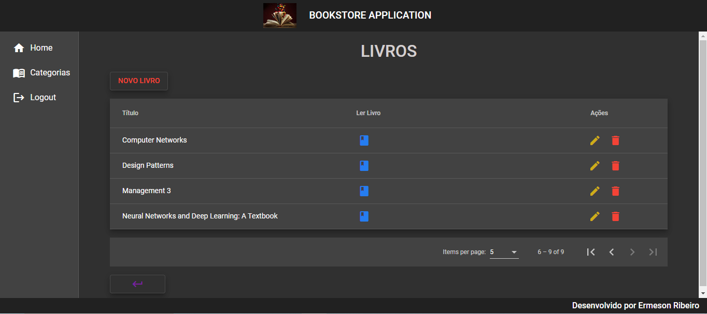
</p>

Página de Livros com Paginação - Mobile

<p align="center">
  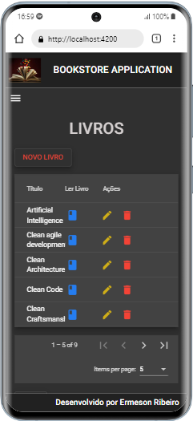
</p>

Página para Exemplificar a Leitura do Livro - Desktop

<p align="center">
  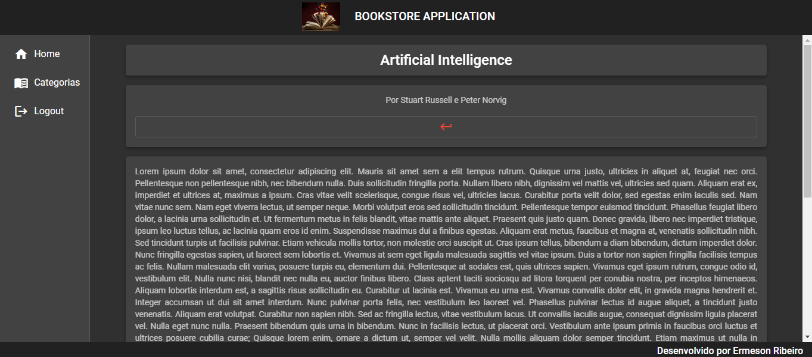
</p>

Página para Exemplificar a Leitura do Livro - Mobile

<p align="center">
  
</p>

## ❗️Executando o código localmente

### Para executar o front-end

Você precisa ter o Node.js / NPM instalado localmente.

1. Instale todas as dependências necessárias:

```
npm install
```

2. Execute o projeto:

```
npm run start
```

Este comando executará o projeto Angular com um proxy para o servidor Java, sem exigir CORS.

Abra seu navegador e acesse **http://localhost:4200** (porta padrão do Angular).